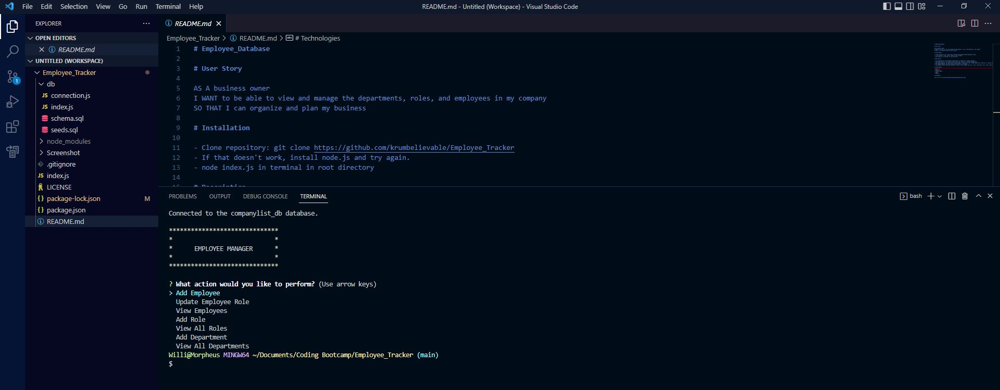

# Employee_Database

# User Story

AS A business owner
I WANT to be able to view and manage the departments, roles, and employees in my company
SO THAT I can organize and plan my business

# Installation

- Clone repository: git clone https://github.com/krumbelievable/Employee_Tracker
- If that doesn't work, install node.js and try again.
- node index.js in terminal in root directory

# Description

- This applications uses database technologies to establish a company database.
- This application is for local terminal use only. There is no client facing side.
- Utlilizing inquite, the paplication shows prompts to guide the user through populating, editing, or viewing the database.
- The seeded database can be accessed through node.js and mySQL.
- This databse shows individual employees, where in the company they work, their individual roles, their supierors, and their pay.

# Technologies

- Node.js
- Javascript
- Console.table
- mySQL
- Inquire

# Screenshot

